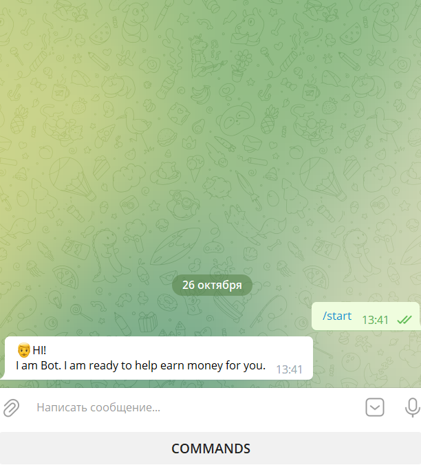
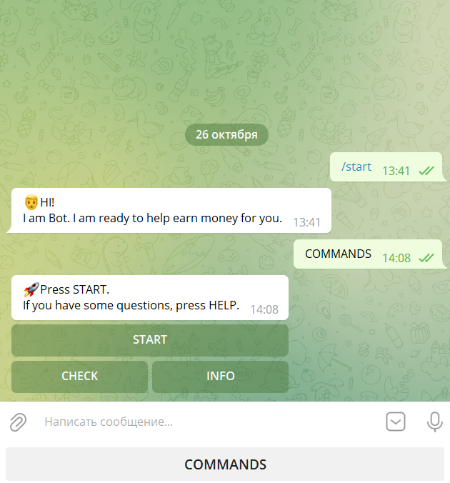
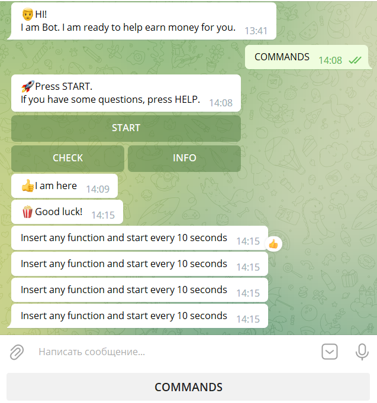
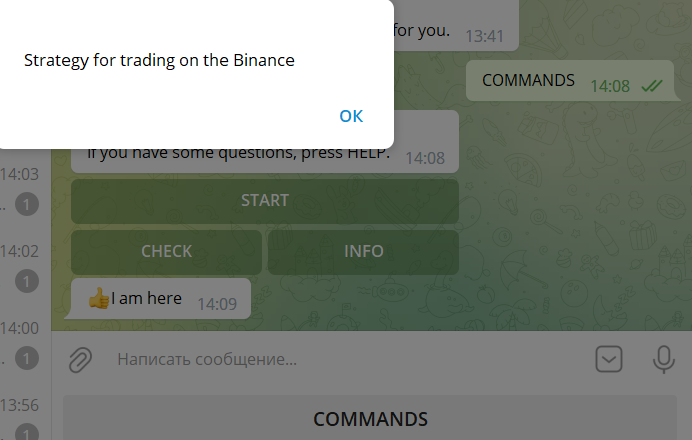
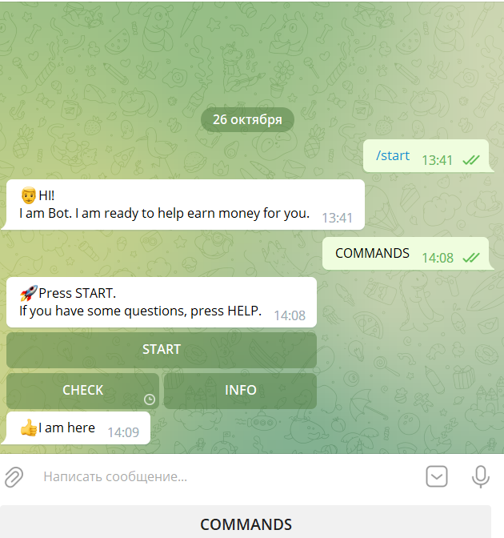

# Introduction
The project was created as basic configuration for managing trading strategies from telegram.

### Installing:
```
$ pip install pyTelegramBotAPI
$ pip install time
$ pip install emoji
```

### Description:
This bot can run function with trading strategy that sends in the Telegram signals after certain time. But, this version only sends signal.


This function to handle the command "/start" in Telegram.

```python
@bot.message_handler(commands=["start"])
def start(message, res=False):
    markup = types.ReplyKeyboardMarkup(resize_keyboard=True)
    btn_strategy = types.KeyboardButton("COMMANDS")
    markup.add(btn_strategy)
    msg = emoji.emojize(":man:") + 'HI!\nI am Bot. I am ready to help earn money for you.'
    bot.send_message(message.chat.id, msg, reply_markup=markup)
 ```
 Result:
 
 
 
 This function to handle the command "COMMANDS" in Telegram.
 
```python
@bot.message_handler(content_types=["text"])
def handle_text(message):
    if message.text.strip() == 'COMMANDS':
        keyboard = types.InlineKeyboardMarkup()
        btn_start = types.InlineKeyboardButton(text='START', callback_data='cycle_start')
        btn_info = types.InlineKeyboardButton(text='INFO', callback_data='cycle_info')
        btn_check = types.InlineKeyboardButton(text='CHECK', callback_data='cycle_check')
        keyboard.add(btn_start)
        keyboard.add(btn_check, btn_info)
        msg = emoji.emojize(":rocket:") + 'Press START.\nIf you have some questions, press HELP.'
        bot.send_message(message.chat.id, msg, reply_markup=keyboard)
```
Result:



This function to handle the command "START" in Menu.

```python
@bot.callback_query_handler(func=lambda call: call.data.startswith('cycle_start'))
def callback_worker_promo(call):
    msg = emoji.emojize(":popcorn:") + 'Good luck!'
    bot.send_message(call.message.chat.id, msg)
    chat_id = call.message.chat.id

    while True:

        msg = 'Insert any function and start every 10 seconds'
        bot.send_message(chat_id, msg)

        time.sleep(10)
  ```
  Result:



This function to handle the command "INFO" in Menu.

```python
@bot.callback_query_handler(func=lambda call: call.data.startswith('cycle_info'))
def callback_worker_info(call):
    msg = 'Strategy for trading on the Binance'
    bot.answer_callback_query(callback_query_id=call.id, text=msg, show_alert=True)
```
  Result:



This function to handle the command "CHECK" in Menu. If you need to check working bot or not.

```python
@bot.callback_query_handler(func=lambda call: call.data.startswith('cycle_check'))
def callback_worker_check(call):
    msg = emoji.emojize(":thumbs_up:") + 'I am here'
    bot.send_message(call.message.chat.id, msg)
```
  Result:


